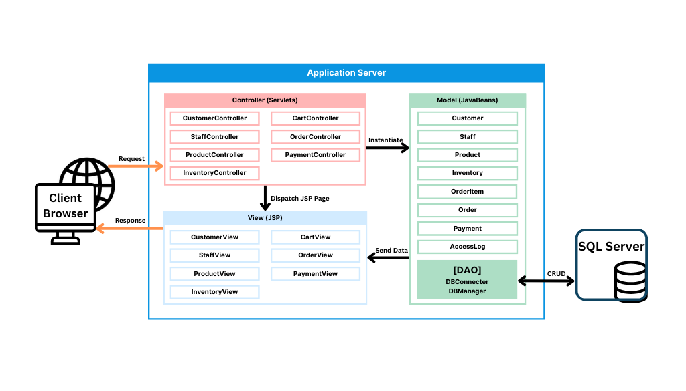

# IoTBay
A full-stack Java web application that supports the following core features based on user roles:

> Customer users (members & guests) can:
  - Register and log in (members only)
  - Browse IoT products
  - Add/update/remove items in their cart
  - Place orders and make payments
  - Track order history and manage their account (members only)

> Staff users can:
  - Manage product inventory and stock levels
  - Manage customer and staff accounts

** Demo Video: https://youtu.be/QSD-Nl6hVC4?si=30dGTxrfRkXeFUaU

---
## Implementation (MVC Architecture)
- **Model**: JavaBeans & JDBC DAO 
- **View**: JSP + HTML/CSS + javascript 
- **Controller**: Java Servlets 
- **Database**: SQLite (relational schema, integrated with DAO layer)
- **Testing**: JUnit 4.13 + Mockito

---
## My Contribution (Ina Song)
> As a **project lead**
  - Designed the overall MVC structure and database schema (ERD)
    
    
  - Oversaw system integration, coordinating feature connections across servlets and pages
  - Handled navigation and workflow design between all key modules 

> As a developer
  - Implemented Order and Product Browsing modules across full MVC layers:
    **Model**(DB and JavaBeans): Order, OrderItem, CartItem, OrderManager, ProductManager, related DAO logic
    **View**: browse.jsp, cart.jsp, orderdetail.jsp, orderhistory.jsp, productdetail.jsp
    **Controller**: BrowseProductServlet, CartServlet, OrderDetailServlet, OrderHistoryServlet, ProductDetailServlet

  - Developed all cart and order-related features for both guest and member users
  - Built validation logic for cart operations (stock checks, quantity control)
  - Created JUnit/Mockito tests to ensure functionality of all related features

